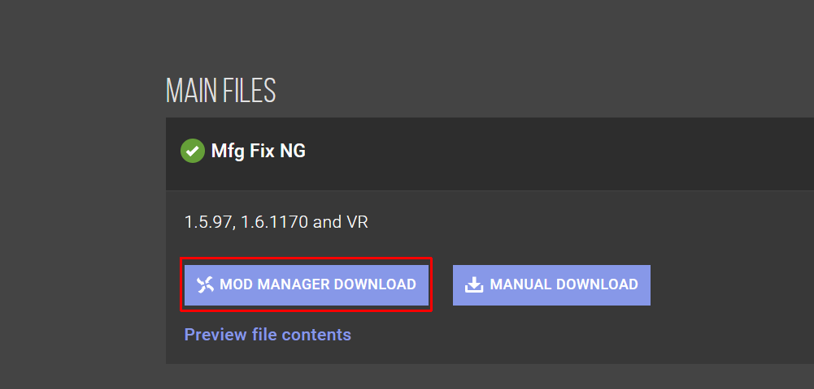

# Mod Organizer

### 左侧边栏

左侧边栏为 **Mod 文件管理**模块，用来管理 Mod 文件。

默认使用优先级排序，优先级数字越大，文件优先级越高。

> 例如：
>
> A Mod 优先级为 1，其根目录下有一个文件 `hello.txt`
>
> B Mod 优先级为 2，其根目录下也有一个文件 `hello.txt`
>
> 在游戏运行时会加载 B Mod 提供的 `hello.txt` 文件

### 右侧边栏

右侧边栏主要用来管理插件（esp、esl）等。

主要使用 LOOT 排序。

### 关联 NexusMods

关联 NexusMods 后可以直接使用 MO2 下载 Mod，在管理 Mod 信息时比较方便。按照提示操作即可关联。

关联后在 NexusMods 网页选择“Mod Manager Download” 即可使用 MO2 下载 Mod。

下载后的 Mod 在右侧栏目的“下载”标签中进行管理。

