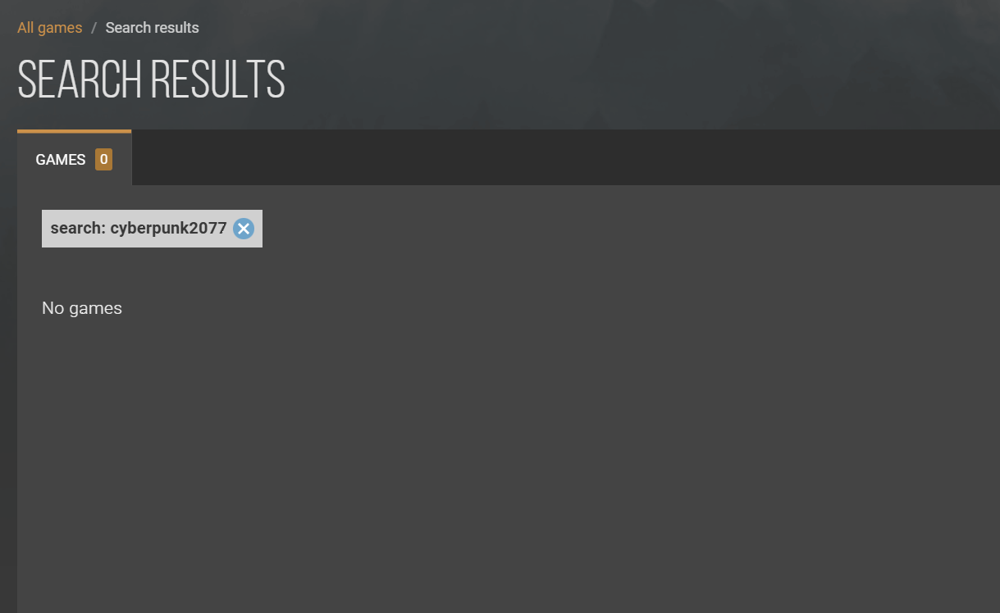
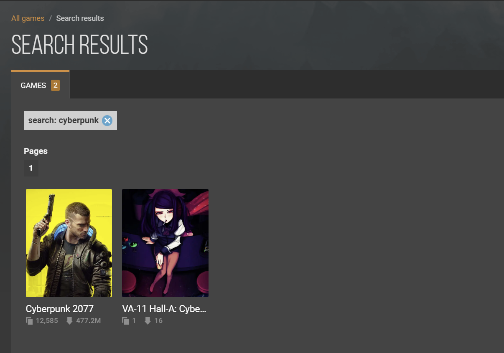

import WikipediaLink from '@site/src/components/WikipediaLink'

# NexusMods

## 简介

NexusMods 是一个托管电脑<WikipediaLink path="游戏模组">游戏模组</WikipediaLink>（Mod）和其他与视频游戏模组相关的用户创建内容的网站。

它是网络上最大的游戏模组网站之一，截至 20241104，拥有 5500 万注册会员和 3194 款支持的游戏，拥有一个论坛和一个针对网站和模组相关主题的 Wiki。

## 注册

在 N 网下载 Mod 需要登陆账号，使用邮箱注册即可。

## 设置

N 网默认屏蔽成人内容，可以在 `Site preferences` -> `Content blocking` 设置显示或模糊显示屏蔽内容。

## 搜索

### N网搜索关键词需要精确匹配

**例：**

搜索“cyberpunk2077” 不会得到任何结果。

搜索“cyberpunk”得到以下结果。

因此推荐在使用搜索功能时尽量简化关键词，**可以少字但是不能错字**。

### 搜索结果默认为时间排序

一般需要将排序方法改为 “Endorsements” 配合时间筛选找到需要的 Mod。

