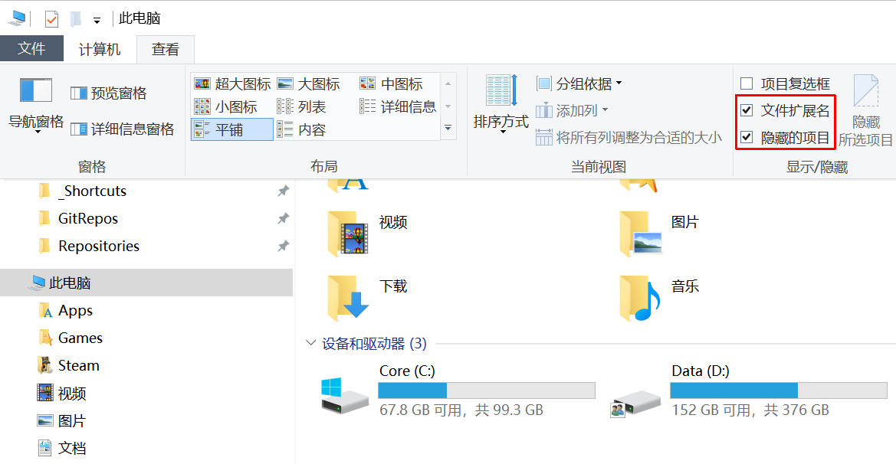
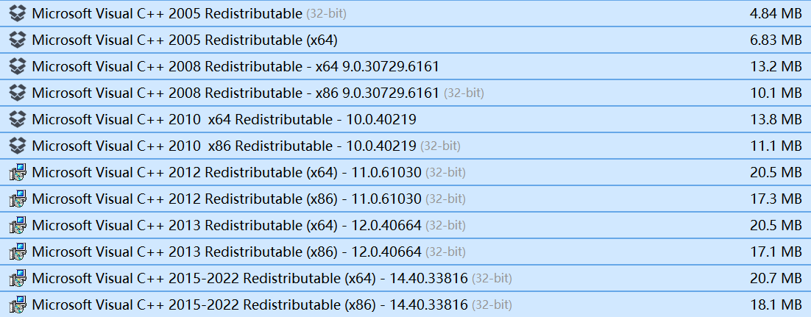

import WikipediaLink from '@site/src/components/WikipediaLink'

# 基础知识

> 对 Mod 过程有所帮助的一些基础知识。

## 电脑设置

### 资源管理器显示设置

> 显示<WikipediaLink>文件扩展名</WikipediaLink>，显示隐藏的项目。

### 安装运行库 MSVCR

> Microsoft Visual C++ Redistributable，是大量游戏以及软件依赖的运行库。x86、x64 版本均推荐安装。

官方地址：https://learn.microsoft.com/zh-cn/cpp/windows/latest-supported-vc-redist?view=msvc-170

### 安装最新/稳定显卡驱动程序

NVIDIA 官方地址：https://www.nvidia.com/en-us/geforce/drivers/

AMD 官方地址：https://www.amd.com/en/support/download/drivers.html

### Windows 10 1809+

> 或 Windows 11

Mod Organizer 2.5.0+ 以及之后版本，都需要 Windows 10 1809+。

## 基础软件

> 仅为推荐，可自行选择合适同类软件。

### 文本编辑器

> Mod 过程中会需要编辑各种文本文件来自定义 Mod、自定义游戏体验。

- [Sublime Text](https://www.sublimetext.com/)
- [VS Code](https://code.visualstudio.com/)

### 压缩软件

> 部分 Mod 可能会需要压缩、解压缩操作。

- [7-Zip](https://www.7-zip.org/)
- [NanaZip](https://github.com/M2Team/NanaZip/)
