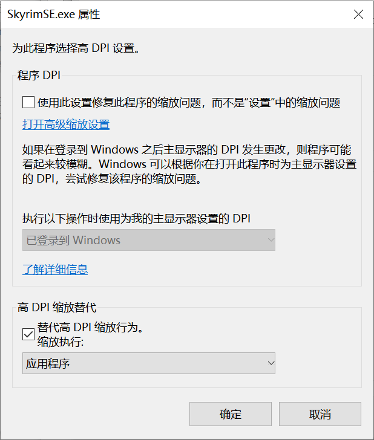

# 安装游戏

## 注意事项

- 如果你想安装旧版本游戏，**不要**使用任何降级游戏的方法。

  绝大部分降级教程已过时，最新版游戏添加了新文件与新特性，可能会带来很多问题。除非你清楚的知道你在做什么。

  可以在网络上寻找纯净版游戏本体或者[自行在 Steam 下载旧版本游戏](/docs/tutorials/preparation/game-version/#最新版可以直接通过-steam-安装那么-1597-版本的游戏如何获得呢)。

- 为了保证 Mod 兼容性并减少 Bug，游戏语言需要设置为英文。后续自行安装汉化 Mod。

- 不要使用 `C:\Program Files`、`C:\Program Files (x86)` 等安装路径。

- 安装后至少运行原版游戏一次以生成默认游戏配置文件。

- 周年版进入游戏会提示是否下载 DLC 内容，下载过程中需要确保网络通顺。

- 在游戏分辨率缩放有问题时可以尝试修改游戏 DPI 缩放设置（可选）。

  1. 在`SkyrimSE.exe`上右键，选择属性。

  2. 选择`兼容性`选项卡。

  3. 点击下方`更改所有用户设置`。

  4. 点击`更改高DPI设置`。

  5. 勾选`替代高 DPI 缩放行为。`

  6. 缩放执行交给`应用程序`。

  
