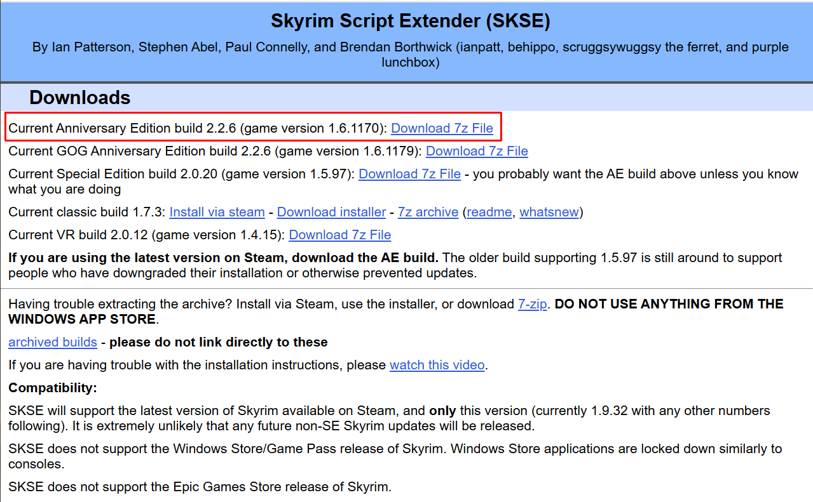
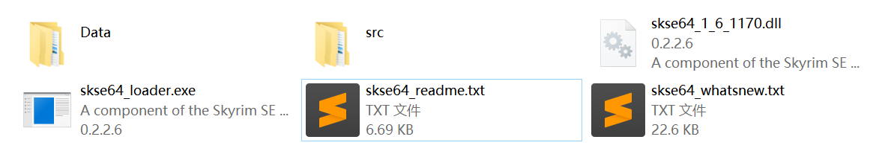
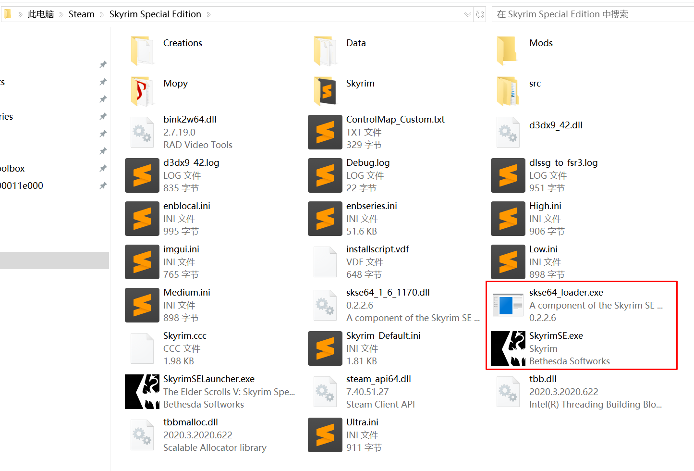
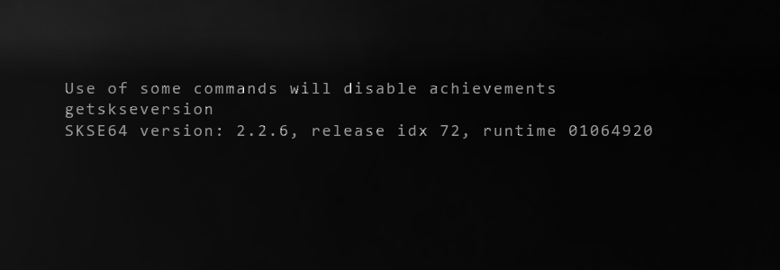

# 安装 SKSE

SKSE 全称为 Skyrim Script Extender。

SKSE 是海量 Mod 的前置，是上古卷轴 5 Mod 基础中的基础。

## 官网

- https://skse.silverlock.org/
- https://www.nexusmods.com/skyrimspecialedition/mods/30379

## 下载

务必选择对应游戏版本的正确版本。Steam 最新版游戏下载置顶的最新版 SKSE 即可。

## 安装

下载完成后，解压缩，得到如下文件。其中 `skse64_readme.txt` 以及 `skse64_whatsnew.txt` 可以删除，如果你感兴趣里面的内容删除前也可以读一读。

将解压缩后得到的文件全部复制或移动到游戏根目录，与`SkyrimSE.exe`同目录即可，效果如下。

## 验证

双击 `skse64_loader.exe` 运行游戏。进入游戏后，按下键盘左上角的 `~` 键，
输入 `getskseversion` 并回车。

如果正确安装，会正确显示当前 SKSE 版本。

