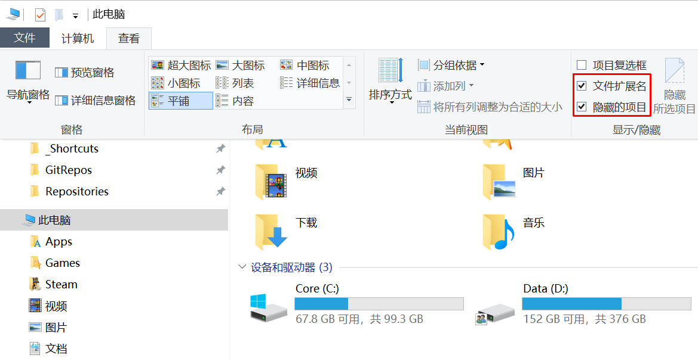
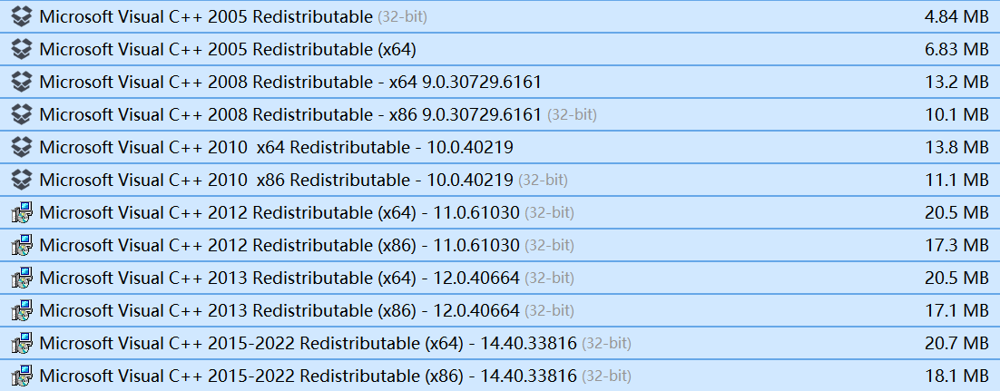
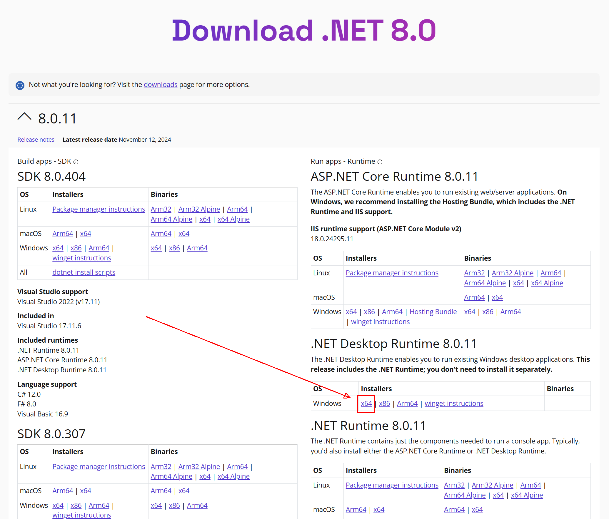

import WikipediaLink from '@site/src/components/WikipediaLink'

# 基础知识

> 在开始安装 Mod 前，需要确保系统环境配置合理，并掌握一些必要的基础工具。

---

## 🖥 系统环境准备

### 📁 显示文件扩展名与隐藏文件

在 Mod 安装过程中，我们需要修改或确认一些 `.ini`、`.dll` 等文件。因此请确保：

- ✅ 已启用 <WikipediaLink path="文件扩展名">文件扩展名</WikipediaLink> 显示
- ✅ 显示隐藏的项目

你可以在「文件资源管理器 → 查看 → 显示」中进行设置，如下图所示：

---

### 🧱 安装 MSVCR 运行库

> Microsoft Visual C++ Redistributable

这是多数游戏和 Mod 工具运行所依赖的运行库。若缺失，常会出现 DLL 缺失报错。

- 请下载并安装 **x86 和 x64 两个版本**
- 官方下载地址：  
  👉 [点击前往微软官网](https://learn.microsoft.com/zh-cn/cpp/windows/latest-supported-vc-redist?view=msvc-170)

安装完成后效果如下图所示：

:::tip
全部安装完成后建议重启系统以确保生效。
:::

---

### 🔧 安装 .NET 8.0 运行环境

某些 Mod 工具（如 Wabbajack、Mutagen）可能基于 .NET 构建，缺失可能导致无法打开。

- 官方下载地址：  
  👉 [下载 .NET 8.0](https://dotnet.microsoft.com/en-us/download/dotnet/8.0)

安装 **.NET Desktop Runtime** 即可

---

### 🎮 更新显卡驱动程序（建议）

最新的显卡驱动可提升稳定性与兼容性，尤其是涉及 ENB、Reshade、画质 Mod 时尤为重要。

但是如果你的显卡较老（GTX 1 0 系列及之前），选择较稳定的版本即可。

- **NVIDIA** 用户：  
  👉 [NVIDIA 驱动官网](https://www.nvidia.cn/geforce/drivers/)
- **AMD** 用户：  
  👉 [AMD 驱动官网](https://www.amd.com/zh-cn/support/download/drivers.html)

---

### 💻 系统版本要求：Windows 10 1809+

Mod 管理器 **Mod Organizer 2.5.0** 起，要求 Windows 10 1809 或更高版本系统。

如系统版本过旧，建议更新至较新的稳定版本，以获得最佳兼容性。

---

## 🧰 常用辅助工具推荐

> 以下为推荐工具，可按个人喜好选择替代品。

---

### 📝 文本编辑器

在 Mod 安装过程中，我们可能需要修改 `.ini`、`.txt`、`.toml` 等配置文件。

带有语法高亮的文本编辑器：

- [Sublime Text](https://www.sublimetext.com/) - 轻量快速
- [VS Code](https://code.visualstudio.com/) - 功能强大，支持扩展丰富

---

### 🗜 压缩/解压工具

部分 Mod / 工具会以 `.zip`、`.7z`、`.rar` 等格式分发，需要解压或打包处理。

推荐工具如下：

- [7-Zip](https://www.7-zip.org/) - 免费开源，功能强大
- [NanaZip](https://github.com/M2Team/NanaZip/) - 现代 UI，适合 Win11 用户
