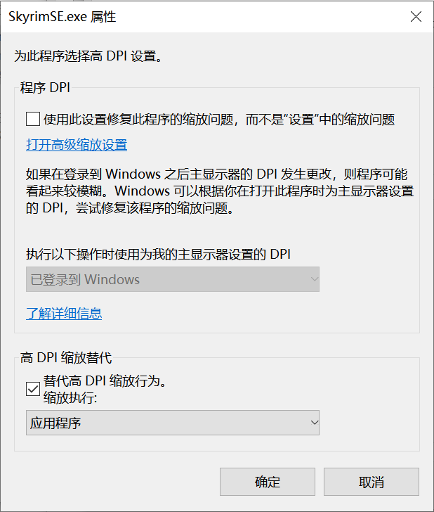

# 安装游戏

## ❗ 注意事项

- ✅ 自行安装 Mod 不建议使用盗版游戏，除非你理解注册表是什么以及知道如何修复游戏注册表路径等问题。
- ✅ 为了保证 Mod 兼容性并减少 Bug，游戏语言需要设置为英文，再安装汉化 Mod。
- ✅ 不要使用 `C:\Program Files`、`C:\Program Files (x86)` 等安装路径，不要使用中文路径。
- ✅ 电脑不要使用中文用户名。
- 👉 在游戏分辨率缩放有问题（比如画面超出屏幕或无法占满屏幕）时可以尝试以下方法修改游戏 DPI 缩放设置。

  1. 在`SkyrimSE.exe`上右键，选择属性。

  2. 选择`兼容性`选项卡。

  3. 点击下方`更改所有用户设置`。

  4. 点击`更改高DPI设置`。

  5. 勾选`替代高 DPI 缩放行为。`

  6. 缩放执行交给`应用程序`。

  
