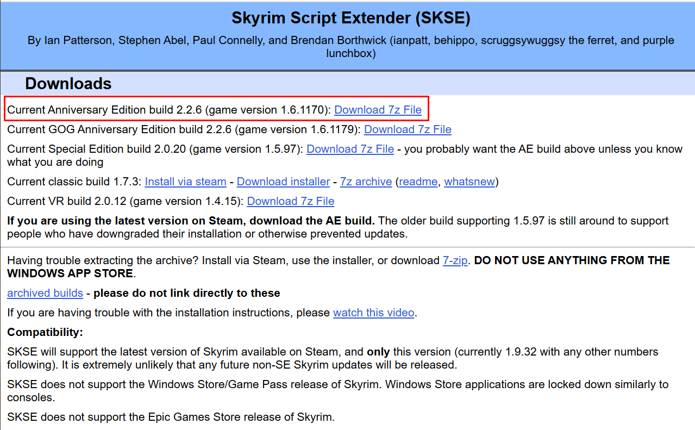
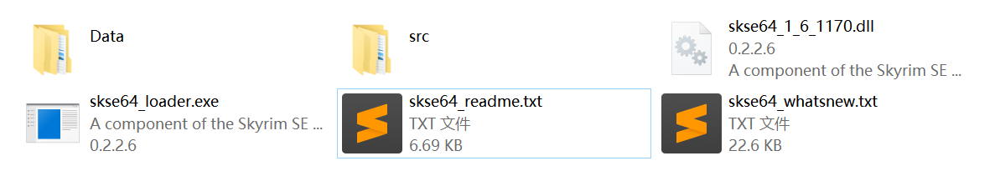
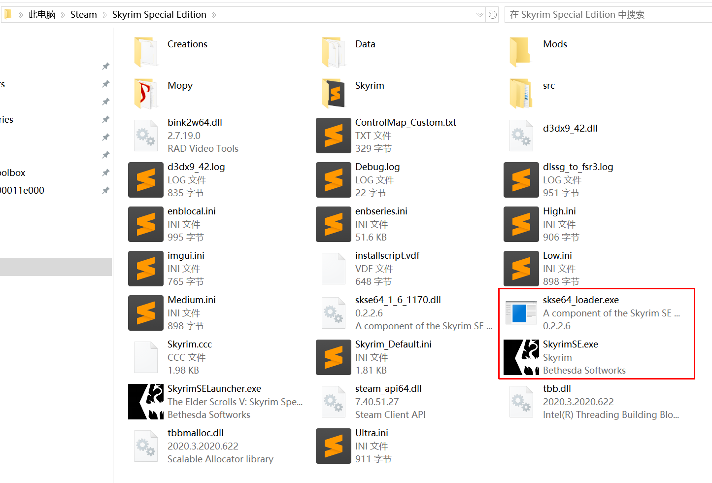
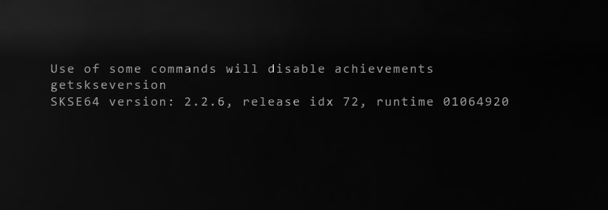

# 安装 SKSE

SKSE 全称为 Skyrim Script Extender。

:::tip
**SKSE 是上古卷轴 5 Mod 基础中的基础，必装中的必装。**。
:::

:::tip
安装 SKSE 后，以后启动游戏都需要通过 **SKSE Loader** 启动，而不是通过 Steam。
:::

## 🌐 官网地址

> 你可以从下面两个官方地址中选择其中一个下载 SKSE。

- https://skse.silverlock.org/
- https://www.nexusmods.com/skyrimspecialedition/mods/30379

## 🔧 如何安装

👉 选择对应游戏版本的正确版本。Steam 最新版游戏下载置顶的最新版 SKSE 即可。

👉 下载完成后，解压缩，得到如下文件。

👉 将解压缩后得到的文件全部复制或移动到游戏根目录，与`SkyrimSE.exe`同目录即可，效果如下。

## 📝 验证安装

**双击 `skse64_loader.exe` 运行游戏**。进入游戏主界面后，按下键盘左上角的 `~` 键，
输入 `getskseversion` 并回车。

如果正确安装，会正确显示当前 SKSE 版本。当前游戏版本 `1.6.1170` 对应的 SKSE 版本为 `2.2.6`。

如下图所示：

