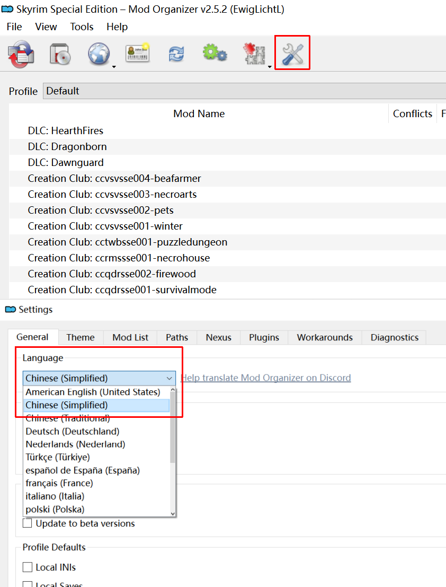
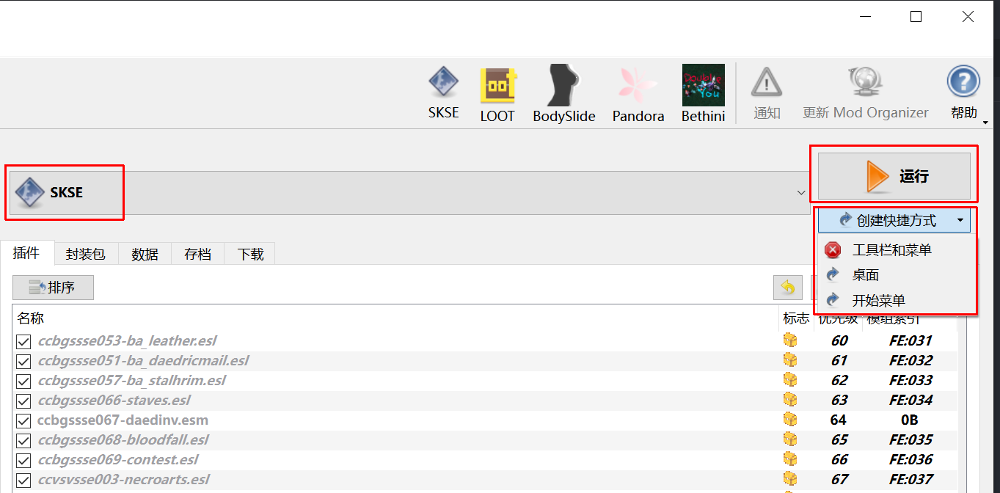
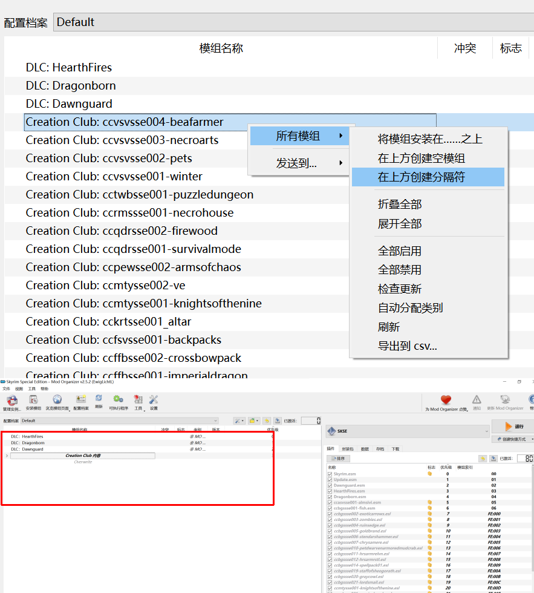
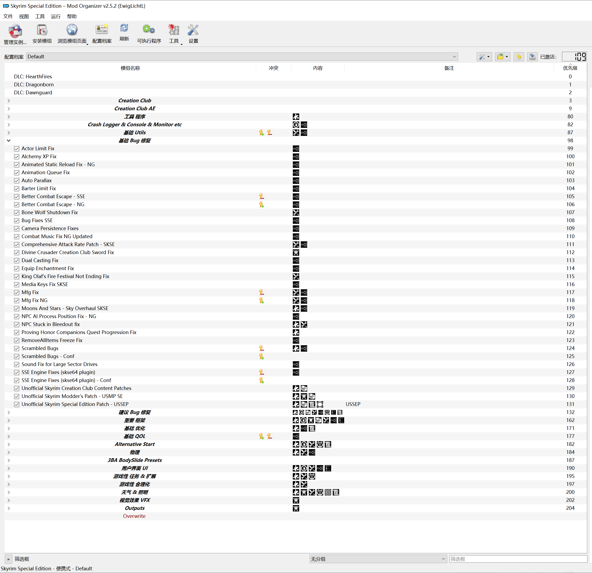

# 安装 MO2

MO2 是对 Mod Organizer 2.0+ 版本的简称。

:::tip
即使只安装个位数的 Mod，也推荐使用 Mod 管理器。

因为 MO2 可以统一管理 Mod，快速解决冲突，且不会修改游戏原文件。
:::

## 🌐 官网

> 二选一下载

- https://github.com/Modorganizer2/modorganizer/releases
- https://www.nexusmods.com/skyrimspecialedition/mods/6194

## 🔧 安装

> 一些注意事项

- 安装路径推荐选择 SSD，硬盘速度越快，游戏启动越快。
- 注意预留硬盘空间，取决于你的 Mod 需求，可能需要数十甚至上百 G 硬盘空间。
- 全局实例与便携实例 MO2 已经给了详细说明，按需选择即可，在给游戏打 Mod 时两者使用并无差别。

## 🛠 基础设置

### 🌐 设置中文

如图：

### 🎮 运行游戏

:::tip
**在使用 MO2 管理 Mod 之后，每一次启动游戏都需要使用 MO2 启动 SKSE 来启动游戏。**

具体原因，请参考[技术细节](/docs/references/mod-organizer/#mo2-管理-mod-的部分技术原理)。
:::

可以创建快捷方式到桌面，方便启动游戏。~~也可以设置通过 Steam 启动打了 Mod 的上古卷轴 5 / 整合包~~ - 待更新。

### ➖ 创建分隔符

创建分隔符可以折叠内容以方便管理 Mod。保持左侧边栏整洁。

👉 如何创建：

👉 整理后的示例：

:::tip
建议保持良好的 Mod 分类整理习惯，否则随着 Mod 数量越来越多，管理起来会越发麻烦。
