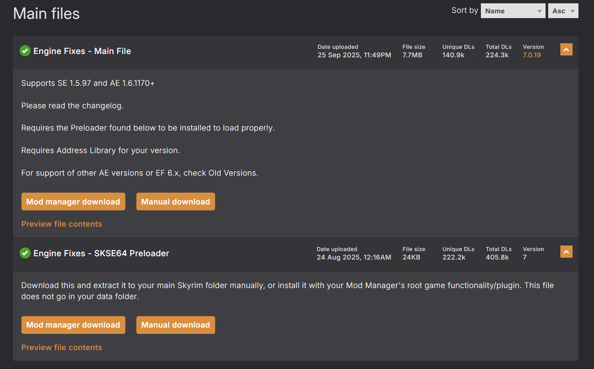
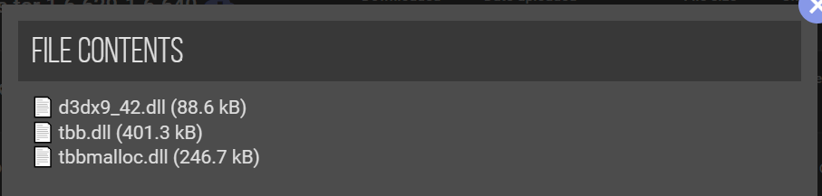
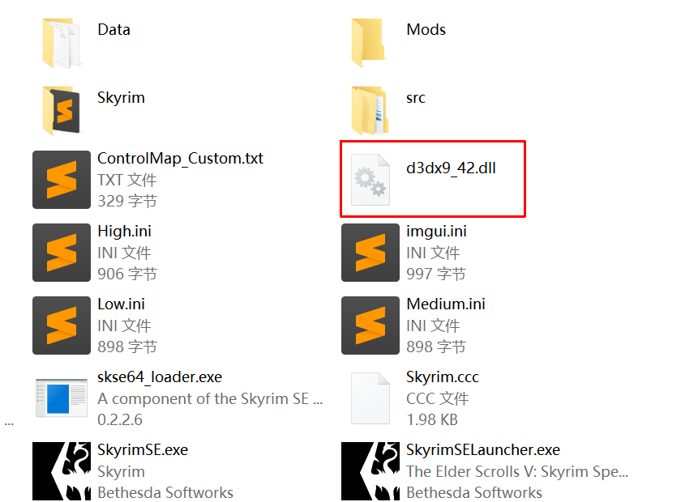

import NexusmodsPage from '@site/src/components/NexusmodsPage'

# 启用成就

游戏在安装 Mod 后默认情况下会禁用成就功能，可以通过安装启用成就的 Mod 来恢复成就功能。

## 安装 SSE Engine Fixes

<NexusmodsPage nexusCode="17230"> SSE Engine Fixes </NexusmodsPage>修复了游戏中的各种引擎错误，附带启用成就功能。是必装 Mod 之一。

1. 在 Mod 页面分别下载游戏对应版本的 Part1 和 Part2.

    

2. 将 Part1 通过 MO2 直接安装。

3. 将 Part2 解压缩，得到三个 dll 文件。

    

4. 将三个 dll 文件直接移动到游戏跟目录，与 `SkyrimSE.exe` 同级，即可。

    
