import ModList from '@site/src/components/ModList'
import NexusmodsPage from '@site/src/components/NexusmodsPage'

export const skinMods = [
   { name: 'Diamond Skin - CBBE and UNP Female Textures', nexusCode: '45718' },
   { name: 'Fair Skin Complexion', nexusCode: '798' },
   { name: 'The Pure CBBE and UNP - 4K or 8K Female Skin Textures', nexusCode: '20583' },
]

# 角色美化

## 捏人大修

### RaceMenu

> RaceMenu 对角色创建菜单进行全面修改，包括新的自定义功能，例如多个 RGBA 战绘、人体彩绘、手部彩绘和足部彩绘。

在 NexusMods 下载 RaceMenu，然后在 MO2 中安装即可。

安装前：较为基础的捏人界面。

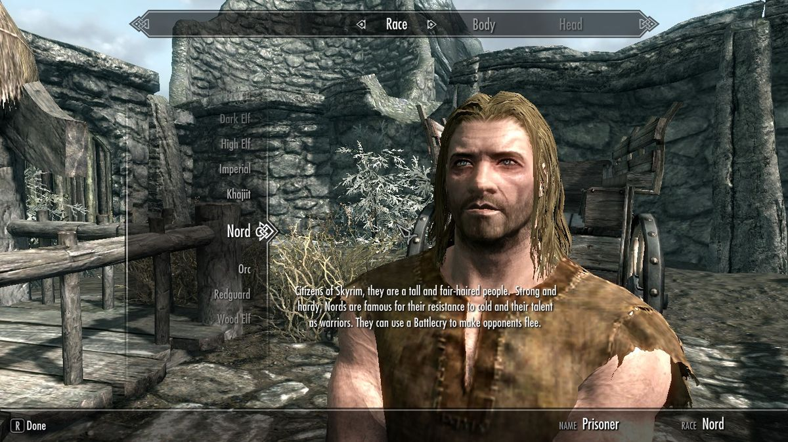

安装后：比较全面的捏人界面。

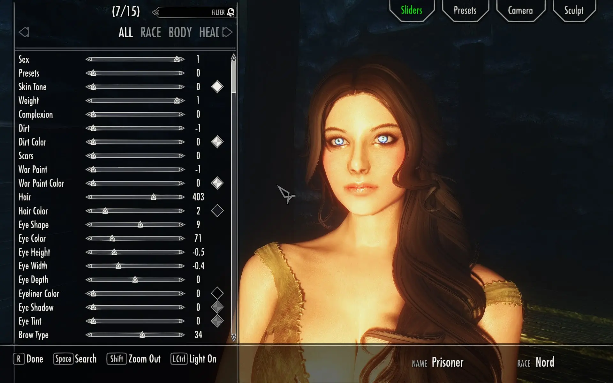

### 验证安装

打开游戏后加载游戏，按`~`（键盘左上角）打开控制台，输入`showracemenu`即可打开角色创建菜单，查看是否安装成功。

## 身形选择

> 身形 Mod 的作用是替换游戏默认的角色身体。使角色皮肤更光滑、曲线更优美、身材更符合审美。
> 
> **如果只做基础的人物美化，仅安装 <NexusmodsPage nexusCode="198"> CBBE </NexusmodsPage> 即可极大改善游戏体验。**

目前主流体型有两种：**3BA** 与 **BHUNP**。

**3BA**：基于 CBBE，支持的服装 Mod 最多，被使用最多的身形 Mod。

**BHUNP**：用户量仅次于 3BA，细节略多一些，支持的服装 Mod 略少一些。

本教程以 3BA 为例。BHUNP 使用原理相同。

## 安装身形

> 3BA 是在 CBBE 的基础上改进的体型，为 CBBE 增加了更好的网格、更多样的身形支持等。
>
> 由于 3BA 依赖于 CBBE，需要先安装 CBBE。

### 安装 CBBE 身形

1. 使用 N 网下载 <NexusmodsPage nexusCode="198"> CBBE </NexusmodsPage>。

   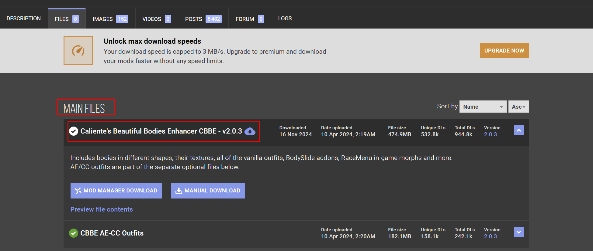

2. 使用 MO2 安装 CBBE。

3. 安装时会有一些选项，保持默认选项即可。如果你知道选项是什么意思也可以按照自己的意愿修改选项。

### 安装 CBPC 物理

> CBPC 全称 CBPC - Physics with Collisions for SSE and VR
>
> 让角色身体具有物理效果。

1. 安装 <NexusmodsPage nexusCode="1988"> XP32 Maximum Skeleton Special Extended - XPMSSE </NexusmodsPage>。（安装时选择 Basic 即可。）
2. 安装 <NexusmodsPage nexusCode="21224"> CBPC - Physics with Collisions for SSE and VR </NexusmodsPage>。

### 安装 3BA 身形
> 3BA 全称 CBBE 3BA (3BBB)
>
> 安装 3BA 之前需要安装一些前置 Mod。

1. 安装 <NexusmodsPage nexusCode="91616"> SMP-NPC crash fix </NexusmodsPage>
2. 安装 <NexusmodsPage nexusCode="57339"> FSMP - Faster HDT-SMP </NexusmodsPage>
3. 安装 <NexusmodsPage nexusCode="13048"> PapyrusUtil SE - Modders Scripting Utility Functions </NexusmodsPage>

最后，安装 <NexusmodsPage nexusCode="30174"> CBBE 3BA (3BBB) </NexusmodsPage>

### 安装 3BA 服装

> 因为游戏中角色身体与服装的网格都是独立的，每次安装新的服装 Mod 后都要刷身形。
>
> 为了让原版服装支持 3BA 身形，需要安装原版服装替换 Mod。

安装 <NexusmodsPage nexusCode="109194"> CBBE 3BA Vanilla Outfits Redone </NexusmodsPage>

在 Mod 前置栏可以看到除了 BodySlide and Outfit Studio ，其他前置都已安装或是非必装前置。

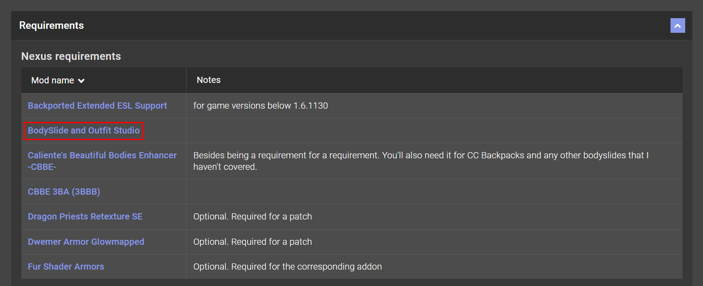

接下来使用 MO2 安装 <NexusmodsPage nexusCode="201"> BodySlide and Outfit Studio </NexusmodsPage>

安装后将 Bodyslide 添加到 MO2 可执行程序里。

1. 在安装后的 BodySlide and Outfit Studio 上右键，选择“在资源管理器中打开”。
   
   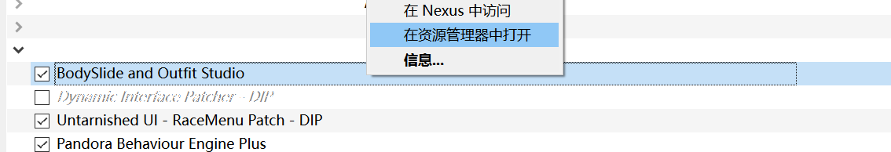

2. 复制文件夹路径。

3. 点击“可执行程序”，选择“从文件添加”。
   
   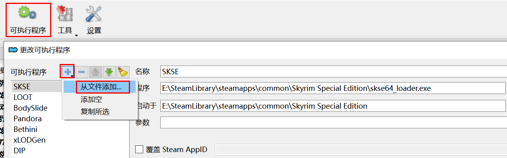

4. 粘贴刚才复制的文件夹路径，并进一步选择“CalienteTools\BodySlide\BodySlide x64.exe”。完成后的示例：

   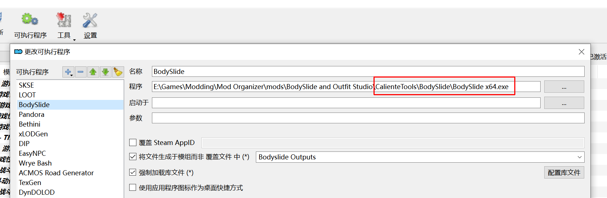

5. 可选操作，可以将所有生成的网格文件统一管理。

   1. 在模组列表，任意位置上右键菜单创建空模组。名称随意，推荐 Bodyslide Outputs 或其他较直观名称。打上勾启用该 Mod。
   
      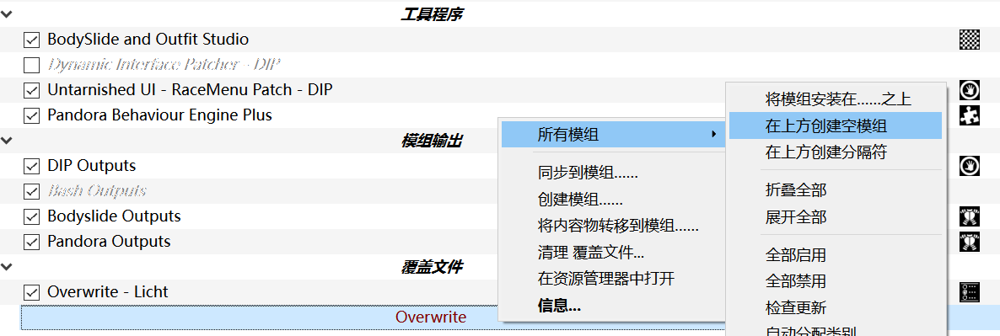
   
   2. 配置“可执行程序”，选择 BodySlide ，勾选“将文件生成与模组而非覆盖文件中”，在后面的下拉菜单中选择刚才创建的空模组。
   
      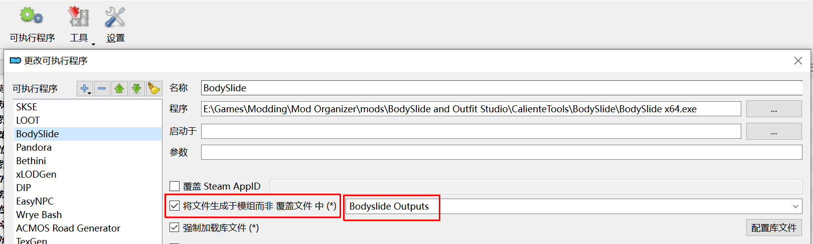 
   
   3. 这之后运行 BodySlide 生成的网格文件只会出现在 BodySlide Outputs 中。方便管理。

### 刷新 3BA 服装

> 成功安装 BS 后，需要刷新所有游戏中的原版服装，才能在游戏中正确显示，在这之前需要选择一个“身形”。
 
这里的身形指的是游戏中角色的“身材”。

简单解释：游戏中所有的角色使用的都是统一具身体，同时每一个角色有自己的身高、体重等数据。
同一具身体按照不同体重体型会略有差别，但也仅仅是略有差别。
这也是游戏中没有胖子和竹竿的原因，因为**相同性别的角色都是同一具身体**。

> 将在后续教程中更新如何使用 **ObodyNG** 给每一位角色都分配不同的身体数据，实现真正的身材多样化。

N网的身形数据太多了，选择自己喜欢的即可。接下来以 <NexusmodsPage nexusCode="74455"> Kurone Body Rustic 3BA BodySlide Preset </NexusmodsPage> 为例，刷新服装。

1. 正常下载并使用 MO2 安装 Kurone Body Rustic 3BA BodySlide Preset。

2. 通过 MO2 启动 BodySlide。

   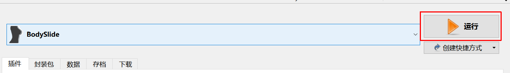

3. Preset 选择 “Kurone Body Rustic”。点击左下角“Batch Build” 即可批量刷新服装。

   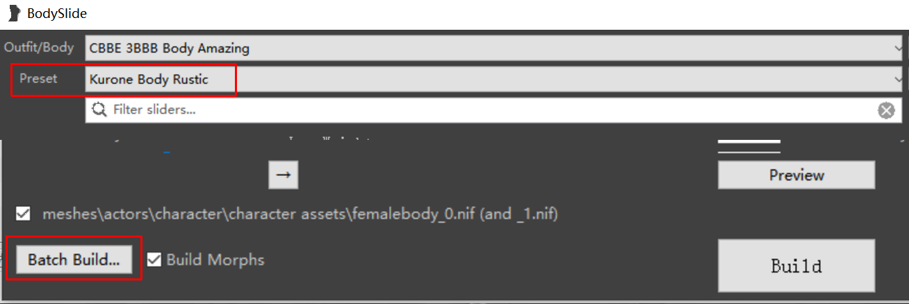

## 安装皮肤

> 如题，替换角色皮肤。

常用皮肤 Mod，任选其一或在N网搜索自己喜欢的皮肤 Mod。

<ModList modList={skinMods} />
