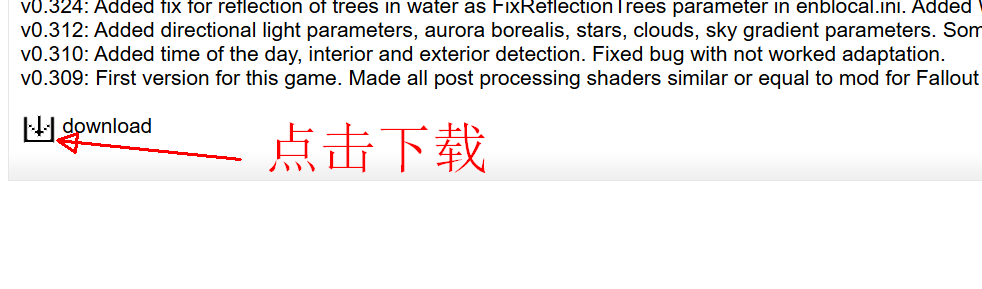
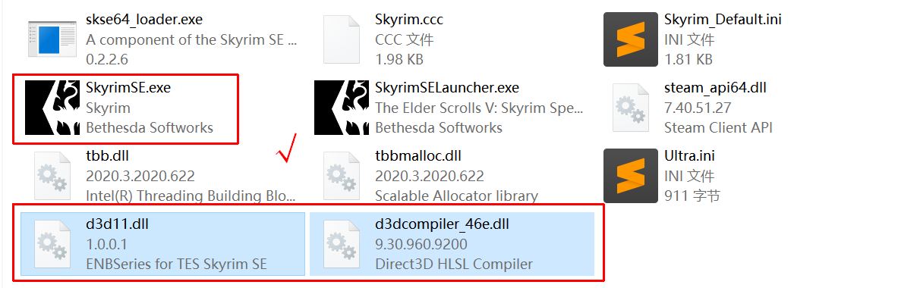

import NexusmodsPage from '@site/src/components/NexusmodsPage'

## CS

> 全称 Community Shaders，以下简称 CS。

CS 不是 ENB 的平替，而是另一种选择。

### 安装 CS

CS 的安装非常简单，在N网下载 <NexusmodsPage nexusCode="86492"> Community Shaders </NexusmodsPage>，通过 MO2 安装即可。

在安装 CS 本体后，安装 CS 的特性插件。这些特性可以在游戏内通过CS菜单随时开关。

### 启动游戏

安装完 CS 后**第一次**启动游戏时需要编译着色器，会花费一些时间。

### 配置 CS

在游戏内按下 END 键打开 CS 配置菜单。

## ENB

> 最常用的画质提升“Mod”。

### 下载ENB

> ENB TESSE 官方地址 http://enbdev.com/download_mod_tesskyrimse.html

访问官网，选择最新版 ENB。

点击版本号进入详情页面。点击页面最底部的图标下载 ENB。

### 安装本体

解压缩或直接双击打开 ENB 压缩文档。

复制 `d3d11.dll` 与 `d3dcompiler_46e.dll` 到游戏根目录。**是的其他文件都是多余的。**

### 安装预设

N 网搜索 ENB 即可，本教程以 <NexusmodsPage nexusCode="99398"> Silent Horizons 2 - Universal Core </NexusmodsPage> 为例。

SH2 除了需要安装 ENB 本体，还需要安装额外依赖，这两个依赖使用 MO2 正常安装即可。

下载 SH2，解压缩所有文件并放到游戏根目录。

### 启动游戏

游戏启动会变慢，这是正常现象。

ENB 在游戏启动时会显示一些信息，这是正常现象。如果 ENB 有更新也会在游戏启动时提示。

### 配置ENB

Just FYI。

游戏中按 Shift + Enter 会打开 ENB 设置页面。普通玩家一般不用动这里。

### 卸载ENB

删除所有步骤中用到的的文件以及 Mod ，以及游戏根目录中的 `enbcache` 文件夹。