import ModList from '@site/src/components/ModList'
import NexusmodsPage from '@site/src/components/NexusmodsPage'

export const bfcoRequirements = [
    { name: 'Address Library for SKSE Plugins', nexusCode: '32444' },
    { name: 'Animation Motion Revolution', nexusCode: '50258' },
    { name: 'BFCO Universal Support', nexusCode: '120091', note: "可选，仅周年版需要安装" },
    { name: 'MCM Helper', nexusCode: '53000', },
    { name: 'Open Animation Replacer', nexusCode: '92109' },
    { name: 'PapyrusUtil SE - Modders Scripting Utility Functions', nexusCode: '13048' },
    { name: 'Payload Interpreter', nexusCode: '65089' },
]

# BFCO

> 官网：https://magicskyrim.net/archives/24282
>
> BFCO 是烽火原创战斗动作框架（同类作品参考 mco/abr/skysa），对上古卷轴 5 的动作系统进行现代化改造。V3 版支持近战和远程武器动作，限第三人称。
> 
> -- 摘自官网

## 特性

> -- 摘自官网

- 原生支持方向重击/原版攻速 buff（因此兼容任何技能树大修模组）
- 原生支持 NPC 出招逻辑（NPC 与玩家共享注释和派生规则，自动连招无需特殊设置）
- 支持空中和水下攻击
- 支持 DIY 蓄力攻击
- 支持 DIY 派生注释
- 可配置的 MCM 菜单

## 安装 BFCO

### Mod 前置

> 安装下列 Mod，同时注意安装这些 Mod 的前置。

{ <ModList modList={bfcoRequirements} /> }

BFCO 仅支持 Nemesis 与 Pandora。这里使用 <NexusmodsPage nexusCode="133232"> Pandora Behaviour Engine Plus </NexusmodsPage>。

### 安装过程

> 下载 <NexusmodsPage nexusCode="117052"> BFCO - Attack Behavior Framework (SSE AE VR) </NexusmodsPage>

通过 MO2 安装，按需选择选项，在兼容补丁选择页面需要注意，如果你安装了较新版本的闪避 Mod DMCO，补丁默认不会被勾选，需要手动勾选。

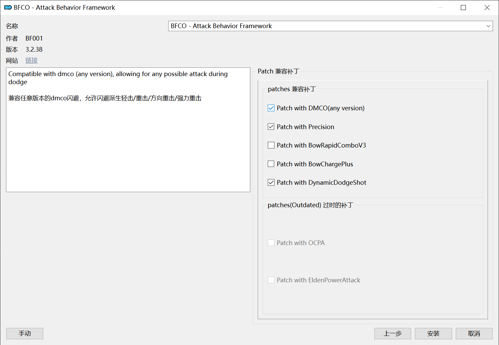

### 刷新动作

Mod 安装之后通过 MO2 启动 Pandora，勾选BFCO补丁，Run。

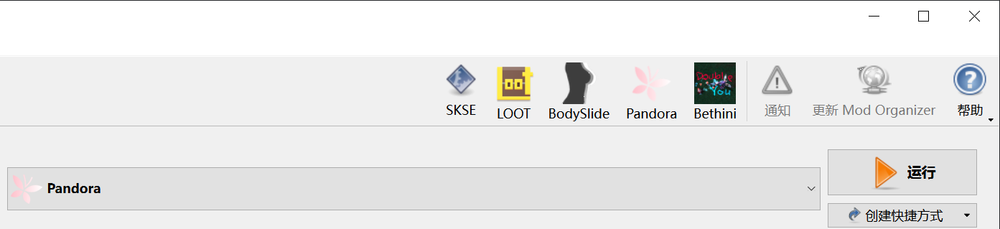

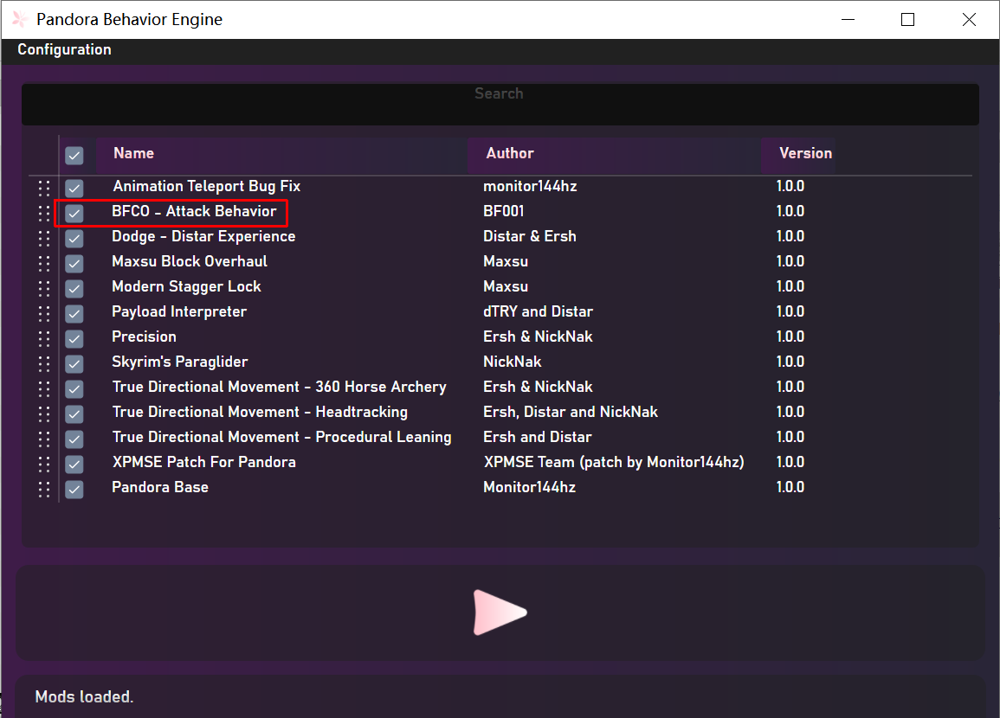

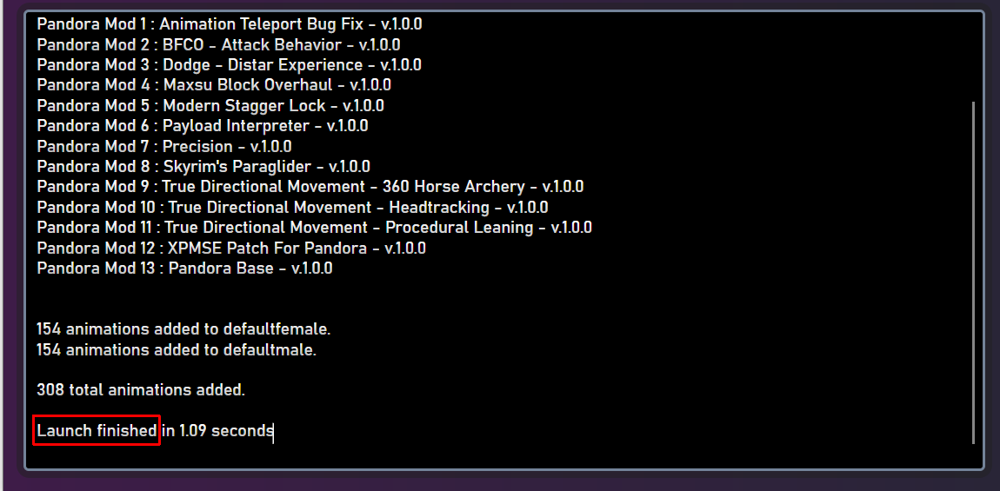

此时就可以进入游戏查看效果了。

## MCO 动作转 BFCO

待更新

{/* > BFCO 默认动作为法环动作，如果想使用其他战斗动作就需要安装对应的 Mod。
>
> 目前原生支持 BFCO 的 Mod 并不多，你可能需要转换 MCO 动作供 BFCO 使用。

### 准备工作

- 下载 <NexusmodsPage nexusCode="119926"> MCO to BFCO Converter </NexusmodsPage>，解压缩得到 mco2bfco.exe.DELETEME
- 将 mco2bfco.exe.DELETEME 重命名为 mco2bfco.exe
- 下载 <NexusmodsPage nexusCode="54244"> hkanno64 </NexusmodsPage>，解压缩得到一个文件夹，若干文件。
- 将 mco2bfco.exe 移动到 hkanno64 文件夹内，与 hkanno64 同级。
    
    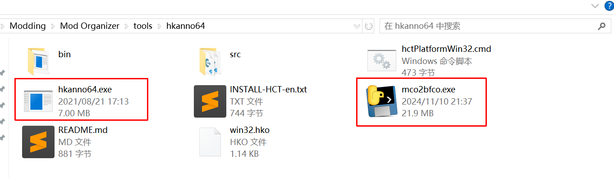

- **下载并安装** [Havok Content Tools x64 2010](https://www.softpedia.com/get/Programming/Other-Programming-Files/Havok-Content-Tools.shtml#download)

    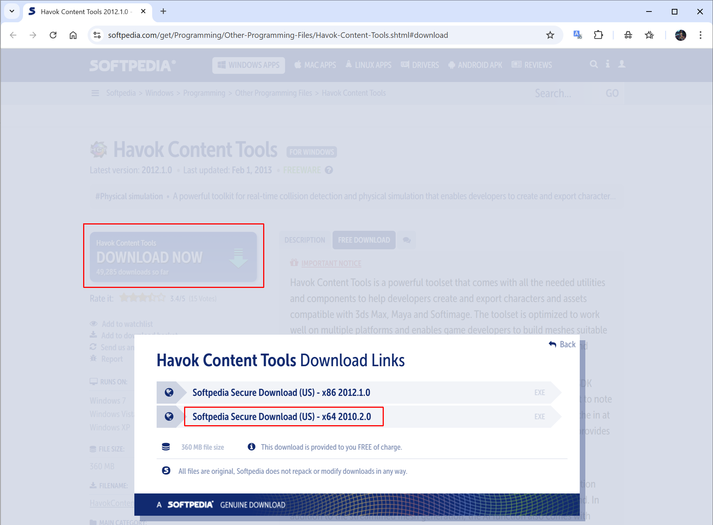

### 转换动作

> 以 <NexusmodsPage nexusCode="65899"> Vanargand Animations - Sword Dual Wield Moveset MCO - SkySA </NexusmodsPage> 为例。

- 下载该动作 Mod，通过 MO2 安装。
- 右键该 Mod，在资源管理器中打开，**复制路径**。

    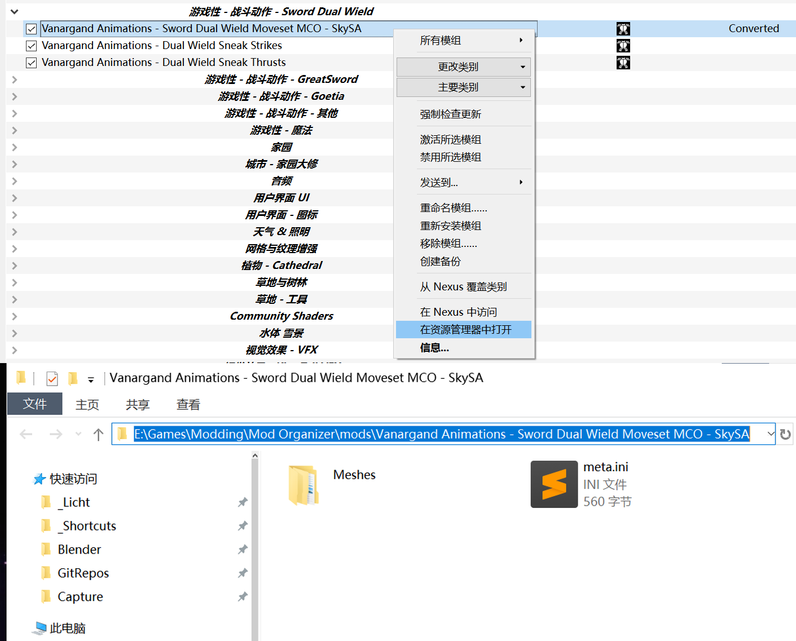

- 双击打开 mco2bfco.exe，Select Folder，**粘贴刚才复制的路径**，回车，选择该文件夹。

    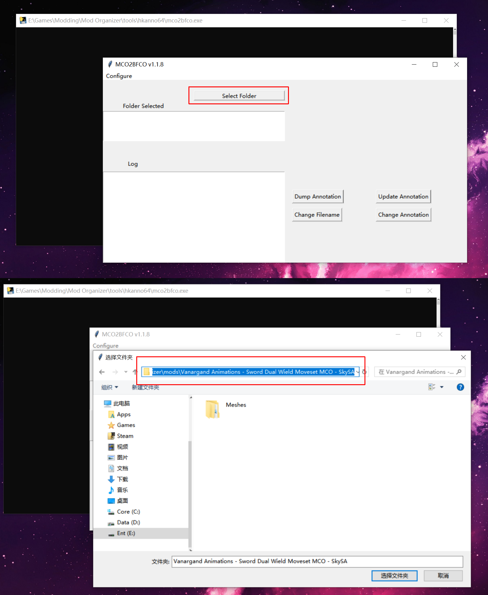

- 点击 Change Annotation，等待片刻待成功信息显示 。

    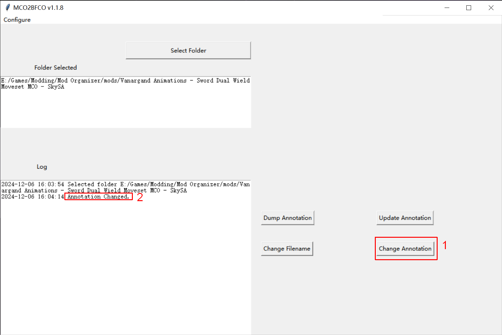

- 点击 Change Filename，等待成功信息显示。

    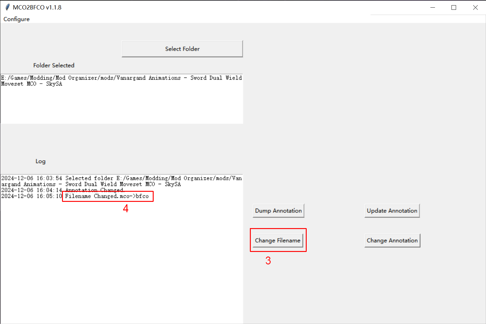

- 此时所有的 MCO 动作均已转换为 BFCO动作。

    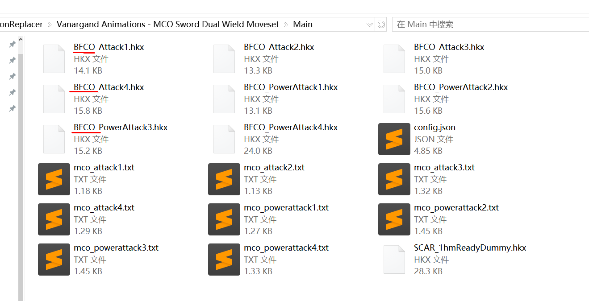

- 进入游戏验证。 */}